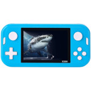

# Wiz

  
|Component|Description                              |
|---------|-----------------------------------------|
|CPU      |Actions Semi ATS3603 MIPS24KEc 450MHz    |
|RAM      |64MB                                     |
|Screen   |4.3" 800x480                             |
|Slot     |MicroSD                                  |
|Gamepad  |DPad, 4 Buttons, Start, Select, L1 and R1|
|Port     |MiniUSB                                  |
|Battery  |3.7V 1200mA                              |
|Dimension|152mm x 73mm x 18mm                      |
|Weight   |130g                                     |

### https://steward-fu.github.io/website/index.htm
